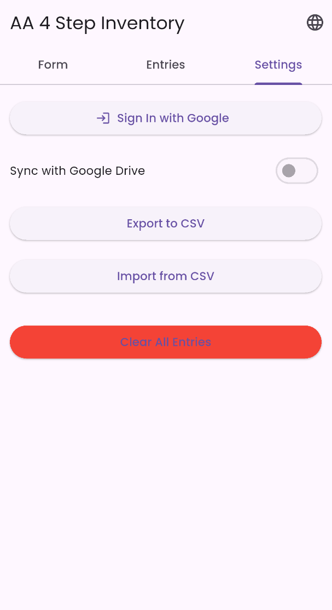
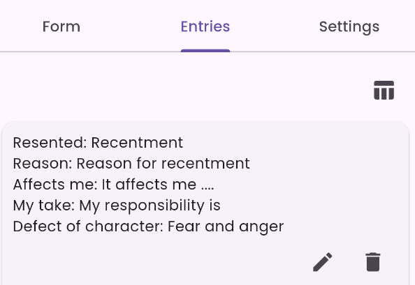

# AA 4Step Inventory

A Flutter application for managing 4th step inventory entries with local storage, Google Drive sync, and JSON import/export capabilities.





## Overview

This app helps users create and manage inventory entries following the AA 4-step process. Each entry contains:
- **Resentment**: Who or what you're resentful towards
- **I Am**: Your role/perspective (e.g., "the son", "the banker") - optional, contextualizes the resentment
- **Reason (Cause)**: Why you're resentful from that role's perspective
- **Affects my**: Which part of self was affected
- **My Take**: Your part in the situation (self-analysis)
- **Shortcomings**: Character defects revealed

### Key Concept: "I Am" Definitions

The "I Am" feature allows viewing the same resentment from different perspectives:
- Example 1: "Mom" as **the son** → affects self-reliance
- Example 2: "Mom" as **the banker** → affects economic safety

Users can define multiple "I Am" identities in Settings with optional reasons. One default exists: **"Sober member of AA"**.

## Architecture

### UI Structure

The app uses **Flutter Modular** architecture with a tab-based interface:

```
ModularInventoryHome (Main Container)
├── AppBar
│   ├── Title: "AA 4Step Inventory"
│   └── Actions
│       ├── Gear Icon (Settings) → Opens Data Management Page
│       └── Language Selector (Globe Icon) → English/Danish toggle
│
└── TabBarView (3 tabs)
    ├── FormTab: Create/Edit entries with I Am selection
    ├── ListTab: View all entries in table/card format
    └── SettingsTab: Manage I Am definitions (CRUD)
```

**Data Management Page** (accessed via gear icon):
- Google Sign In/Out
- Sync toggle (enable/disable Google Drive sync)
- Export to JSON (includes I Am definitions)
- Import from JSON (with data loss warning)
- Fetch from Google Drive
- Clear all entries

### Data Model

**IAmDefinition** (Hive model, typeId: 1)
```dart
@HiveType(typeId: 1)
class IAmDefinition {
  @HiveField(0) String id;           // UUID
  @HiveField(1) String name;         // e.g., "the son", "the banker"
  @HiveField(2) String? reasonToExist; // Optional explanation
}
```

**InventoryEntry** (Hive model, typeId: 0)
```dart
@HiveType(typeId: 0)
class InventoryEntry extends HiveObject {
  @HiveField(0) String? resentment;
  @HiveField(1) String? reason;
  @HiveField(2) String? affect;
  @HiveField(3) String? part;      // "My Take"
  @HiveField(4) String? defect;    // "Shortcomings"
  @HiveField(5) String? iAmId;     // Links to IAmDefinition
  
  // Convenience getters
  String? get myTake => part;
  String? get shortcomings => defect;
  
  // JSON serialization
  Map<String, dynamic> toJson();
  factory InventoryEntry.fromJson(Map<String, dynamic> json);
}
```

**Storage**: Local Hive database
- `entries` box: Box<InventoryEntry>
- `i_am_definitions` box: Box<IAmDefinition>
- `settings` box: Untyped box for preferences

### CRUD Operations

All CRUD operations are handled by `InventoryService`:

**Create:**
```dart
await _inventoryService.addEntry(box, entry);
// Automatically triggers Drive sync if enabled
```

**Read:**
```dart
final entries = box.values.toList();
// or
final entry = box.getAt(index);
```

**Update:**
```dart
await _inventoryService.updateEntry(box, index, updatedEntry);
// Automatically triggers Drive sync if enabled
```

**Delete:**
```dart
await _inventoryService.deleteEntry(box, index);
// Automatically triggers Drive sync if enabled
```

**Clear All:**
```dart
await box.clear();
DriveService.instance.scheduleUploadFromBox(box); // Sync empty state
```

### Google Drive Sync

**Architecture:**
- `DriveService`: Singleton managing sync state and operations
- `GoogleDriveClient`: Handles Drive API communication
- `InventoryDriveService`: Clean service layer for Drive operations
- `sync_utils.dart`: Background serialization helpers

**Sync Flow:**
1. User signs in via Google (OAuth)
2. App creates `GoogleDriveClient` with auth tokens
3. Sync toggle enables/disables automatic uploads
4. CRUD operations trigger debounced uploads (700ms)
5. Data stored in Drive AppData folder as `aa4step_inventory_data.json`

**JSON Format:**
```json
{
  "version": "2.0",
  "exportDate": "2025-11-13T...",
  "iAmDefinitions": [
    {"id": "uuid", "name": "the son", "reasonToExist": "..."}
  ],
  "entries": [
    {
      "resentment": "Mom",
      "reason": "she doesn't love me",
      "affect": "self reliance",
      "part": "maybe i haven't been the best son",
      "defect": "Self will run riot",
      "iAmId": "uuid"
    }
  ]
}
```

**Key Features:**
- Silent sign-in at app startup
- Debounced uploads to coalesce rapid changes
- Background serialization using `compute()` isolates
- Conflict resolution: Drive data overwrites local on fetch
- **Data Safety**: I Am definitions synced before entries

### JSON Import/Export

**Export:**
```dart
await _exportJson();
// Creates JSON with:
// - Version number (2.0)
// - Export timestamp
// - I Am definitions (with IDs)
// - Entries (with iAmId references)
// Filename: inventory_export_<timestamp>.json
```

**Import:**
```dart
await _importJson();
// Shows WARNING dialog (data will be replaced)
// Imports I Am definitions first
// Then imports entries with preserved iAmId links
// Backward compatible with old format (no iAmId)
```

**Data Safety Features:**
- ✅ Cannot delete I Am if used by entries
- ✅ Warning dialog before import (data replacement)
- ✅ I Am definitions imported before entries
- ✅ Backward compatible with old JSON format
- ✅ NULL safety for missing I Am references

See `DATA_SAFETY.md` for complete testing checklist.

### Localization

Supports **English (en)** and **Danish (da)**:

```dart
t(context, 'key') // Translation helper function
```

**Key translations:**
- `app_title`: "AA 4Step Inventory" / "AA 4 trins opgørelse"
- `data_management`: "Data Management" / "Data Håndtering"
- `i_am`, `my_take`, `shortcomings`, `affect_my`
- `add_i_am`, `edit_i_am`, `delete_i_am`, `i_am_definitions`
- `export_json`, `import_json`, `sync_google_drive`
- Form field labels and validation messages

**Language toggle:** Globe icon in AppBar switches locale, persisted across sessions.

## Development

### Setup
```bash
flutter pub get
flutter pub run build_runner build --delete-conflicting-outputs
```

### Run
```bash
flutter run -d <device>
```

### Build
```bash
# Debug APK
flutter build apk --debug

# Release APK
flutter build apk --release

# App Bundle
flutter build appbundle --release
```

### Version Increment
```bash
dart scripts/increment_version.dart
```

### Code Quality
```bash
flutter analyze
```

## Key Files

- `lib/main.dart`: App initialization, Hive setup, silent sign-in
- `lib/pages/modular_inventory_home.dart`: Main UI container with I Am state
- `lib/pages/form_tab.dart`: Entry creation/editing with I Am selector
- `lib/pages/list_tab.dart`: Table/card view with I Am display
- `lib/pages/settings_tab.dart`: I Am definitions CRUD interface
- `lib/pages/data_management_tab.dart`: JSON/Drive functionality
- `lib/models/inventory_entry.dart`: Entry data model with JSON serialization
- `lib/models/i_am_definition.dart`: I Am data model
- `lib/services/drive_service.dart`: Google Drive sync logic
- `lib/services/inventory_service.dart`: Entry CRUD operations
- `lib/services/i_am_service.dart`: I Am CRUD operations
- `lib/localizations.dart`: Translation system

## Documentation

See the `docs/` folder for detailed documentation:
- `DATA_SAFETY.md`: Data integrity testing checklist
- `REUSABLE_COMPONENTS.md`: Modular components for reuse in other projects
- `BUILD_SCRIPTS.md`: Build automation and version management
- `GOOGLE_OAUTH_SETUP.md`: Google OAuth configuration guide
- `VS_CODE_DEBUG.md`: VS Code debugging setup
- `PLAY_STORE_DESCRIPTIONS.md`: App store listing content
- `PRIVACY_POLICY.md`: Privacy policy for app stores

## Dependencies

- **flutter_modular**: Routing and dependency injection
- **hive/hive_flutter**: Local NoSQL database
- **google_sign_in**: Google authentication
- **googleapis**: Drive API v3
- **http**: HTTP client for API calls
- **uuid**: UUID generation for I Am definitions
- **file_picker**: File selection dialogs
- **flutter_file_dialog**: Save file dialogs

## Platform Support

- ✅ Android (full support with Google Drive sync)
- ✅ iOS (tested)
- ⚠️ Windows/Linux/Web (limited - no file picker support)
